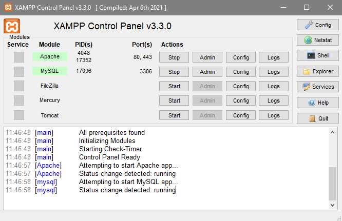
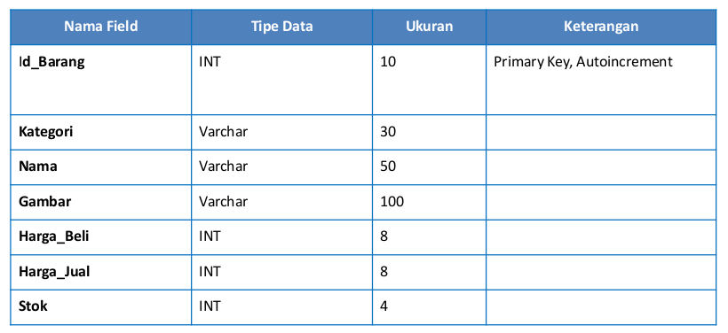
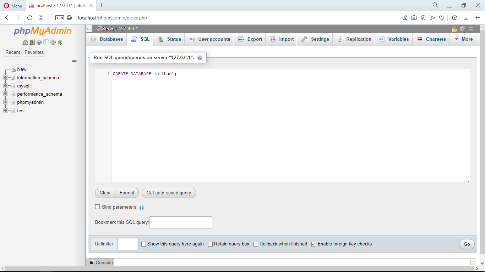
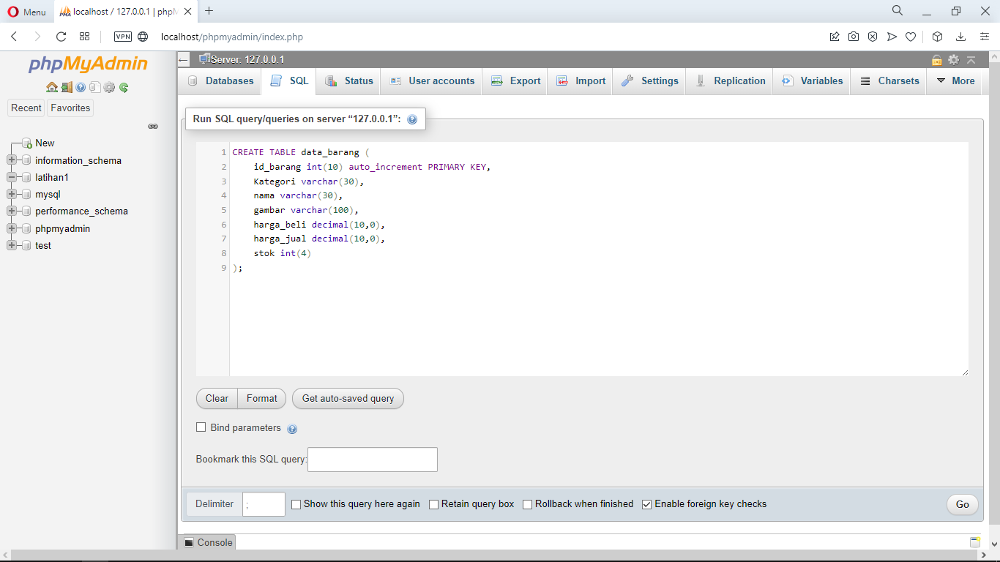
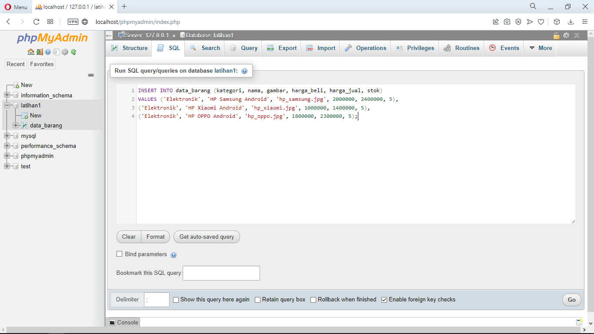
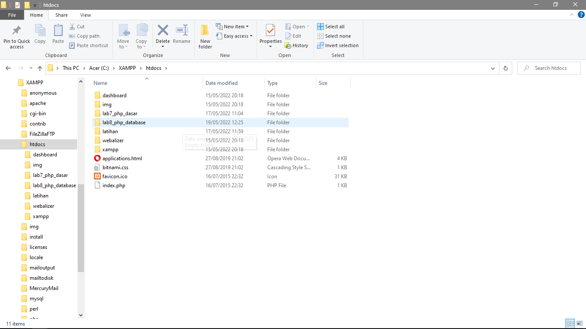

| Nama  | Oktovan Agung Shailendra|
|-------|-------------------------|
|NIM    |: 312010131              |
|Kelas  |: TI.20.A.1              |

---

# Praktikum 8 : PHP & Database MySQL

# Langkah - Langkah Praktikum
## Persiapan
- Untuk memulai membuat aplikasi CRUD sederhana, yang perlu disiapkan adallah database server menggunakan MySQL. Pastikan MySQL Server sudah dapat dijalankan melalui XAMPP.

## Menjalankan MySQL Server
Untuk menjalankan MySQL Server dari menu XAMPP Control.

## Mengakses MySQL Client menggunakan PHP MyAdmin
Pastikan webserver Apache & MySQL server sudah dijalankan. Kemudian buka melalui browser `http://localhost/phpmyadmin/`.

## Membuat Database : Studi Kasus Data Barang

## Membuat Database

## Membuat Tabel

## Menambahkan Data

## Membuat Program CRUD
Buat folder `lab8_php_database` pada root directory web server (c:\xampp\htdocs)
